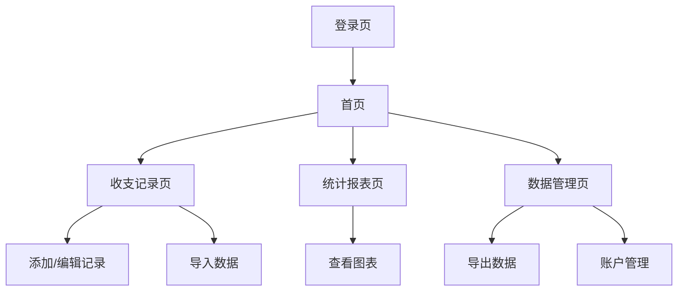

## 1. 产品概述
个人收支管理系统是一个帮助用户记录、分析和管理个人财务的应用。用户可以记录收入和支出，按不同维度查看统计报表，支持数据导入导出功能。

目标用户：需要管理个人财务的个人用户，希望通过数据分析了解收支情况。

## 2. 核心功能

### 2.1 用户角色
| 角色 | 注册方式 | 核心权限 |
|------|----------|----------|
| 普通用户 | 邮箱注册 | 记录收支、查看统计、导入导出数据 |

### 2.2 功能模块
系统包含以下主要页面：
1. **首页**：收支概览、快速添加记录、最近交易
2. **收支记录页**：交易列表、筛选搜索、增删改查操作
3. **统计报表页**：饼图展示收支占比、柱状图展示趋势、分类统计
4. **数据管理页**：导入Excel/CSV、导出数据、账户管理
5. **个人中心**：用户信息、分类管理、设置

### 2.3 页面详情
| 页面名称 | 模块名称 | 功能描述 |
|----------|----------|----------|
| 首页 | 收支概览 | 显示本月收入、支出、结余，支持快速添加收支记录 |
| 首页 | 最近交易 | 展示最近5条交易记录，点击可查看详情 |
| 收支记录页 | 交易列表 | 分页显示所有交易记录，支持按时间、类型、账户筛选 |
| 收支记录页 | 搜索功能 | 支持按关键词搜索交易备注 |
| 收支记录页 | 操作功能 | 新增、编辑、删除交易记录，支持批量操作 |
| 统计报表页 | 饼图统计 | 按分类展示收支占比，支持按月筛选 |
| 统计报表页 | 柱状图趋势 | 展示月度收支趋势，支持自定义时间范围 |
| 统计报表页 | 分类统计 | 按账户、分类统计收支金额 |
| 数据管理页 | 导入功能 | 支持Excel/CSV文件导入，自动匹配字段 |
| 数据管理页 | 导出功能 | 支持按筛选条件导出数据为Excel/CSV |
| 数据管理页 | 账户管理 | 管理支付宝、微信等账户信息 |
| 个人中心 | 用户信息 | 显示和编辑个人资料 |
| 个人中心 | 分类管理 | 自定义收支分类，支持图标设置 |

## 3. 核心流程
用户主要操作流程：
1. 用户注册登录后进入首页，查看收支概览
2. 点击快速添加记录，输入金额、选择类型、分类、账户和备注
3. 在收支记录页查看所有交易，使用筛选功能查找特定记录
4. 进入统计报表页查看图表分析，了解收支结构和趋势
5. 在数据管理页导入历史数据或导出备份

## 4. 用户界面设计

### 4.1 设计风格
- **主色调**：蓝色系（#1890ff）作为主色，绿色（#52c41a）表示收入，红色（#ff4d4f）表示支出
- **按钮样式**：圆角矩形，主要操作为实心按钮，次要操作为边框按钮
- **字体**：系统默认字体，标题16px，正文14px，辅助文字12px
- **布局风格**：卡片式布局，顶部导航栏，左侧边栏导航
- **图标风格**：使用Ant Design图标库，线性图标为主

### 4.2 页面设计概览
| 页面名称 | 模块名称 | UI元素 |
|----------|----------|--------|
| 首页 | 收支概览 | 顶部显示三个统计卡片（收入、支出、结余），使用大号字体和颜色区分 |
| 首页 | 快速添加 | 悬浮按钮，点击弹出表单对话框 |
| 收支记录页 | 交易列表 | 表格形式展示，每行显示时间、分类、金额、账户，支持排序 |
| 统计报表页 | 饼图 | 使用Recharts饼图，支持hover显示具体数值和百分比 |
| 统计报表页 | 柱状图 | 月度对比柱状图，支持切换时间范围 |
| 数据管理页 | 导入区域 | 拖拽上传区域，显示文件格式要求和字段映射 |

### 4.3 响应式设计
- 桌面端优先设计，支持1280px以上宽度
- 平板端自适应，调整布局为上下结构
- 移动端支持基本浏览功能，核心功能可用