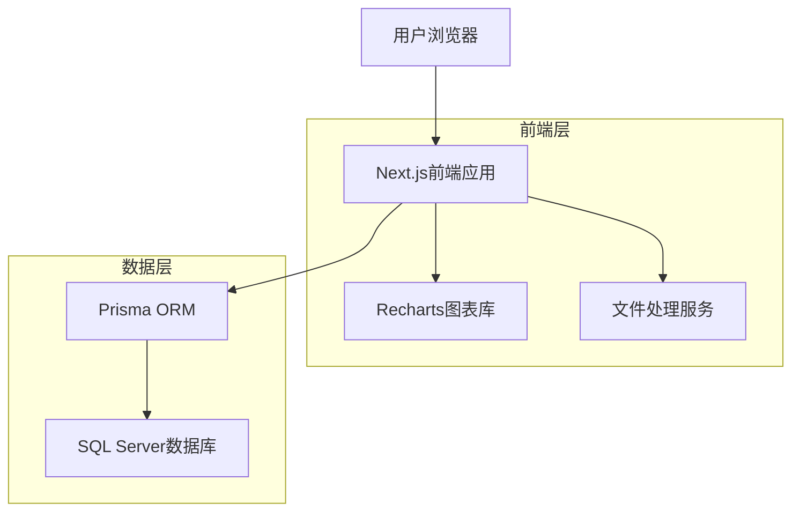
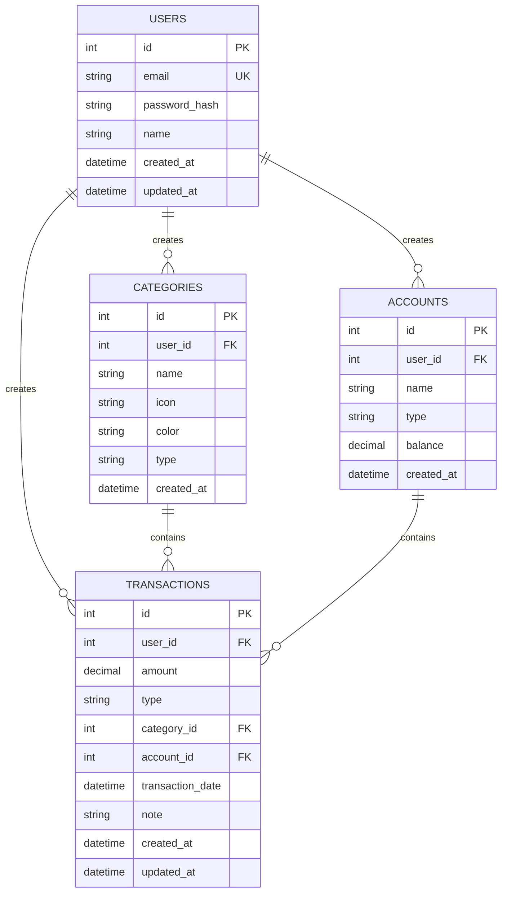

## 1. 架构设计



## 2. 技术描述

- **前端**: Next.js@14 (App Router) + TypeScript + Tailwind CSS
- **初始化工具**: create-next-app
- **数据库**: SQL Server (Docker - Azure SQL Edge)
- **ORM**: Prisma@5
- **图表库**: Recharts
- **文件处理**: SheetJS (Excel/CSV处理)
- **UI组件**: Ant Design

## 3. 路由定义

| 路由 | 用途 |
|------|------|
| / | 首页，显示收支概览 |
| /transactions | 收支记录页面，管理交易记录 |
| /statistics | 统计报表页面，展示图表分析 |
| /data | 数据管理页面，导入导出功能 |
| /profile | 个人中心，用户信息管理 |
| /auth/login | 登录页面 |
| /auth/register | 注册页面 |

## 4. 数据模型

### 4.1 数据模型定义



### 4.2 数据定义语言

用户表 (users)
```sql
CREATE TABLE users (
  id INT PRIMARY KEY IDENTITY(1,1),
  email NVARCHAR(255) UNIQUE NOT NULL,
  password_hash NVARCHAR(255) NOT NULL,
  name NVARCHAR(100) NOT NULL,
  created_at DATETIME2 DEFAULT GETDATE(),
  updated_at DATETIME2 DEFAULT GETDATE()
);

CREATE INDEX idx_users_email ON users(email);
```

分类表 (categories)
```sql
CREATE TABLE categories (
  id INT PRIMARY KEY IDENTITY(1,1),
  user_id INT NOT NULL,
  name NVARCHAR(50) NOT NULL,
  icon NVARCHAR(50),
  color NVARCHAR(7),
  type NVARCHAR(10) CHECK (type IN ('income', 'expense')),
  created_at DATETIME2 DEFAULT GETDATE(),
  FOREIGN KEY (user_id) REFERENCES users(id) ON DELETE CASCADE
);

CREATE INDEX idx_categories_user_id ON categories(user_id);
CREATE INDEX idx_categories_type ON categories(type);
```

账户表 (accounts)
```sql
CREATE TABLE accounts (
  id INT PRIMARY KEY IDENTITY(1,1),
  user_id INT NOT NULL,
  name NVARCHAR(50) NOT NULL,
  type NVARCHAR(20) CHECK (type IN ('alipay', 'wechat', 'cash', 'card')),
  balance DECIMAL(10,2) DEFAULT 0,
  created_at DATETIME2 DEFAULT GETDATE(),
  FOREIGN KEY (user_id) REFERENCES users(id) ON DELETE CASCADE
);

CREATE INDEX idx_accounts_user_id ON accounts(user_id);
```

交易记录表 (transactions)
```sql
CREATE TABLE transactions (
  id INT PRIMARY KEY IDENTITY(1,1),
  user_id INT NOT NULL,
  amount DECIMAL(10,2) NOT NULL,
  type NVARCHAR(10) CHECK (type IN ('income', 'expense')),
  category_id INT NOT NULL,
  account_id INT NOT NULL,
  transaction_date DATETIME2 NOT NULL,
  note NVARCHAR(500),
  created_at DATETIME2 DEFAULT GETDATE(),
  updated_at DATETIME2 DEFAULT GETDATE(),
  FOREIGN KEY (user_id) REFERENCES users(id) ON DELETE CASCADE,
  FOREIGN KEY (category_id) REFERENCES categories(id),
  FOREIGN KEY (account_id) REFERENCES accounts(id)
);

-- 核心索引优化
CREATE INDEX idx_transactions_user_id ON transactions(user_id);
CREATE INDEX idx_transactions_transaction_date ON transactions(transaction_date);
CREATE INDEX idx_transactions_category_id ON transactions(category_id);
CREATE INDEX idx_transactions_type ON transactions(type);
CREATE INDEX idx_transactions_account_id ON transactions(account_id);

-- 复合索引用于统计查询
CREATE INDEX idx_transactions_user_date ON transactions(user_id, transaction_date);
CREATE INDEX idx_transactions_user_category ON transactions(user_id, category_id);
```

### 4.3 Docker配置

```yaml
# docker-compose.yml
version: '3.8'
services:
  sqlserver:
    image: mcr.microsoft.com/azure-sql-edge:latest
    container_name: personal-finance-db
    environment:
      ACCEPT_EULA: Y
      SA_PASSWORD: YourStrong@Passw0rd
      MSSQL_PID: Developer
    ports:
      - "1433:1433"
    volumes:
      - sqlserver_data:/var/opt/mssql

volumes:
  sqlserver_data:
```

### 4.4 Prisma Schema

```prisma
// prisma/schema.prisma
generator client {
  provider = "prisma-client-js"
}

datasource db {
  provider = "sqlserver"
  url      = env("DATABASE_URL")
}

model User {
  id            Int            @id @default(autoincrement())
  email         String         @unique
  passwordHash  String
  name          String
  createdAt     DateTime       @default(now())
  updatedAt     DateTime       @updatedAt
  transactions  Transaction[]
  categories    Category[]
  accounts      Account[]
}

model Transaction {
  id              Int        @id @default(autoincrement())
  userId          Int
  amount          Decimal    @db.Decimal(10, 2)
  type            String     @db.VarChar(10)
  categoryId      Int
  accountId       Int
  transactionDate DateTime   @db.DateTime2
  note            String?    @db.VarChar(500)
  createdAt       DateTime   @default(now())
  updatedAt       DateTime   @updatedAt
  
  user     User     @relation(fields: [userId], references: [id], onDelete: Cascade)
  category Category @relation(fields: [categoryId], references: [id])
  account  Account  @relation(fields: [accountId], references: [id])
  
  @@index([userId])
  @@index([transactionDate])
  @@index([categoryId])
  @@index([type])
  @@index([accountId])
  @@index([userId, transactionDate])
  @@index([userId, categoryId])
}

model Category {
  id           Int           @id @default(autoincrement())
  userId       Int
  name         String        @db.VarChar(50)
  icon         String?       @db.VarChar(50)
  color        String?       @db.VarChar(7)
  type         String        @db.VarChar(10)
  createdAt    DateTime      @default(now())
  
  user         User          @relation(fields: [userId], references: [id], onDelete: Cascade)
  transactions Transaction[]
  
  @@index([userId])
  @@index([type])
}

model Account {
  id           Int           @id @default(autoincrement())
  userId       Int
  name         String        @db.VarChar(50)
  type         String        @db.VarChar(20)
  balance      Decimal       @default(0) @db.Decimal(10, 2)
  createdAt    DateTime      @default(now())
  
  user         User          @relation(fields: [userId], references: [id], onDelete: Cascade)
  transactions Transaction[]
  
  @@index([userId])
}
```